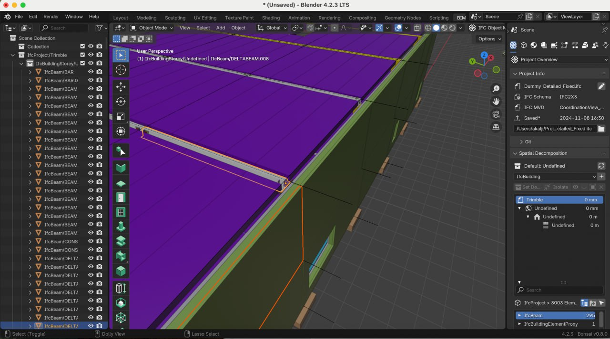
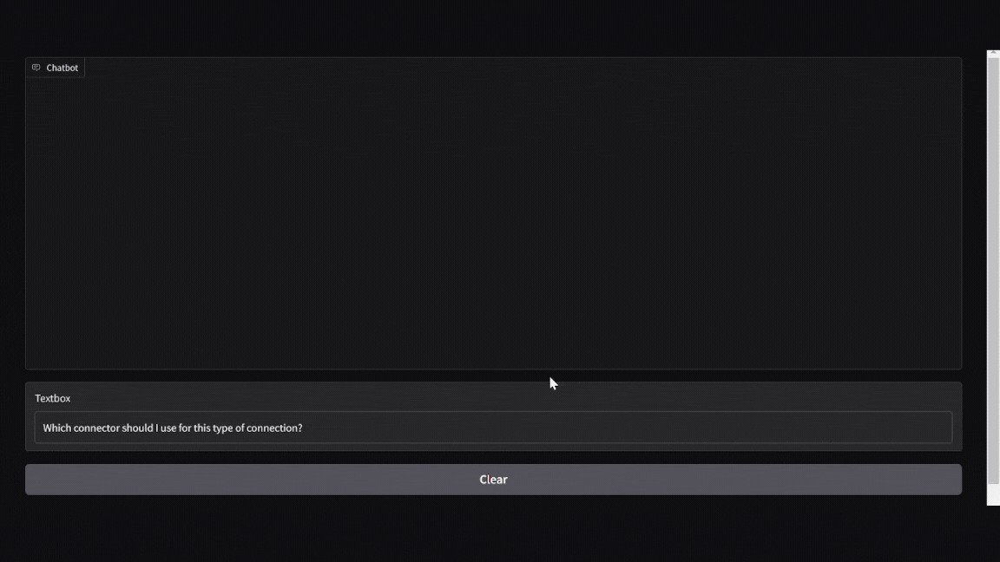

# 🏗️🤖 Peikko Smart Consultant 
 
 

## 🚀 Overview
[**Peikko**](https://www.peikko.com) sells industrial connections for construction, such as beam-to-column connectors, and faces a common problem: 
- Customers provide **IFC files** containing complex building information.
- Choosing the right **Peikko products** requires expert analysis.
- **Sales engineers** invest time in recommendations, often without immediate sales.

**The goal?** Automate and enhance the recommendation process with an AI-driven tool that improves efficiency for both customers and Peikko’s sales team.

## 🔧 Our Solution
We built a **Blender-based tool** that:\
&nbsp;&nbsp;&nbsp;&nbsp;✅ **Visualizes the IFC file** as a 3D model.\
&nbsp;&nbsp;&nbsp;&nbsp;✅ **Analyzes the structure** and identifies places where Peikko connections are needed.\
&nbsp;&nbsp;&nbsp;&nbsp;✅ **Recommends the best products** based on the structure and Peikko’s catalog.\
&nbsp;&nbsp;&nbsp;&nbsp;✅ **Provides an AI assistant** to answer customer queries with real-time contextual knowledge.

## 🏗️ How It Works
### 1️⃣ **3D Visualization & Analysis**
- The IFC file is **imported into Blender** to reconstruct the building model.
- The system **analyzes structural elements** to detect areas where Peikko connections are necessary.
- Key points are **highlighted** for the customer to explore further.

### 2️⃣ **AI-Powered Product Recommendation**
- The user **clicks on a highlighted area**, and the system **suggests suitable Peikko products**.
- The recommendation is based on **building specifics, Peikko’s product catalog, and industrial manuals**.

### 3️⃣ **AI Chatbot Assistance**
- The customer can interact with a **smart AI assistant** to:
  - Ask about specific product details.
  - Understand why a recommendation was made.
  - Get installation or compliance guidance.
- The chatbot uses [**MeiliSearch**](https://www.meilisearch.com/) based knowledge base to provide **context-aware responses**.
  

## 🤝 Team & Acknowledgments
This project was developed as part of **Junction 2024 Hackathon**.

**Team Members:**
- **Aleksandr Shishkov** – AI & Knowledge Base Development  

- **Nikolai Tikhonov** - Team Lead & Project Manager 

- **Konstantin Trubitsyn** – 3D Model Processing & Analysis  

- **Palina Dolbik** – IFC File Processing & Blender Integration  

- **Artsiom Harminovich** – IFC File Processing & Blender Integration  

---
### 📩 Contact
For inquiries, feel free to [reach out](https://www.linkedin.com/in/aleksandrshishkov) or check [Peikko’s official resources](https://www.peikko.com).
